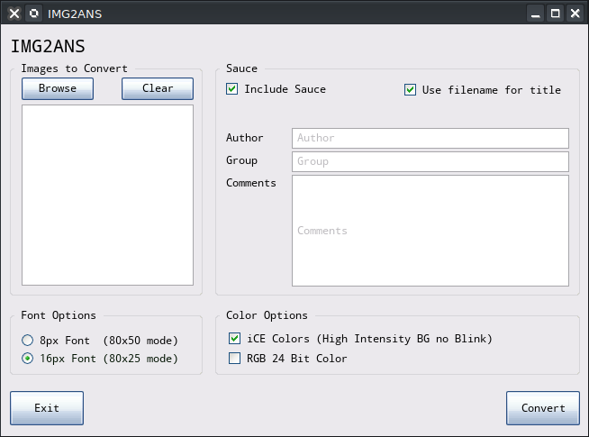

# IMG2ANS

IMG2ANS converts pixels into textmode art using ANSI codes.

> Why did I make this?
There are no native ANSI editors on iOS at ALL.
The use of a remote desktop/VNC while on iOS is possible but it's just horribly unergonomic.
So, I had an idea. What if I used pixel art, and the DOS EGA/CGA 16 color palette to make the pixel art, and then somehow turn it into ANSI? Voila.

IMG2ANS isn't the first of it's kind, but I am proud of the quality of conversion. It can do a 1:1 conversion for RGB or 16 color EGA/CGA in both 8px font (80x50 mode), and 16px (80x25 mode). 

It's still not perfect, and creates gigantic ANSI files because it does not optimize the codes used. However, opening anything converted with `IMG2ANS` and resaving with Moebius, Pablo, IcyDraw, etc. optimizes the file anyway. I will try to make it less bloated and optimal :)

One neat thing that this does is it actually uses the ANSI block characters intelligently. Being an ANSI artist I am very picky about how I draw, and wanted to make it so that this tool would generate really easy to draw-after kinds of ANSIs. 

Also since I know this will be helpful for BBS SysOps I have created a method which does not use iCE colors as much as possible. It will use a black where the iCE was required (if it can't compensate with lower intensity colors). 

The GUI in the screenshot is a WIP front-end for `IMG2ANS` and is created using InForm-PE. It's not done, but I will chip away at it.

The end goal is to have one big GUI program that has options that make the separate .BAS file programs unnecessary. 

-----

### Cross Platform Support:
`IMG2ANS` is written using QB64-PE and as a result is 100% cross platform compatible with:

- Linux
- OSX
- Windows

### Input Image Formats Supported:
`IMG2ANS` supports any QB64-PE supported image formats which includes:

- jpg, png, tga, bmp, psd, gif, pcx, svg, qoi

### Output Image Formats Supported:
`IMG2ANS` will save text files according to the following output types (all of which will embed the font and width and height in the sauce record in addition to the standard sauce stuff like group, author, comments, etc. if it is enabled):
- 16 color ANSI (8px and 16px fonts)
- 24 Bit ANSI (8px and 16px fonts)

### Until the GUI is done...

You can use each one of these separately:

- [IMG2ANS-25.BAS](IMG2ANS-25.BAS)
- [IMG2ANS-50.BAS](IMG2ANS-50.BAS)
- [IMG2ANS-25-NOICE.BAS](IMG2ANS-25-NOICE.BAS)
- [IMG2ANS-25-RGB.BAS](IMG2ANS-25-RGB.BAS)
- [IMG2ANS-50-RGB.BAS](IMG2ANS-50-RGB.BAS)

# USAGE FOR SEPARATE PROGRAMS
For each program, just compile it and run it. I will create a release that will have native binaries for Linux, OSX, and Windows soon. Until then, just get QB64-PE, install it, build it, etc.

## USAGE FOR GUI
- Run the program
- Browse for image files to convert
- Enter sauce information (and optionally include it)
- Choose Font Options
- Choose Color Options
- Click Convert

### 8px Font (80x50 mode)

This is the closest you can get to 1:1 for pixel art conversion. The converted pixel is turned into a 8x8 square character, and intended to be viewed with an 8px font (sauce configuration saved).

### 16px Font (80x25 mode)

In this mode, pixel art can be converted perfectly 1:1 but the versatility required by the 16x8px font helps so it uses full block, and half blocks to convert. It does it's best to minimize the requirement of iCE Colors.

## iCE Colors (High Intensity BG no Blink)

In traditional text mode (SCREEN 0), high intensity background colors are not allowed and will instead cause the text to blink. In iCE Color mode, the blinking is disabled. In QB64 this is the same thing that happens when you use `_NOBLINK` in text screen modes.

## RGB 24 Bit Color

If this is unchecked, the palette to be used will be the DOS CGA/EGA 16 color palette. 

If this is checked, the palette is unrestricted and `CSI;r;g;bt` method of color change is used instead.

In RGB 24 bit, you can convert any pixel art to ANSI text mode 1:1 regardless of the source color palette.

If you are not using RGB 24 bit mode, the source image must use the DOS CGA/EGA 16 color palette, or colors will not map properly for conversion.

#### KNOWN ISSUES
The 25 line mode programs omit the final lines of the ANSI. I will fix this later, but meanwhile to compensate just add some blank lines to the end of the pixel art you're converting (2 blank extra rows of pixels at the bottom should work.)

### SAUCE Support
Sauce support includes:
- Font size
- iCE Colors ON/OFF
- Canvas Width
- Canvas Height
- Author
- Title
- Group
- Comments
- Date

## COMPILING AND BUILDING / INSTALLATION

You need InForm-PE. I recommend checking out this repo adjacent as a sibling to
IMG2ANS like so:

> If you have checked out img2ans in `~/git/img2ans` ...

`cd ~/git`  
`gh repo clone a740g/InForm-PE`  

> Read the README for setup of InForm-PE: https://github.com/a740g/InForm-PE/blob/master/README.md

> Symlink InForm-PE to `~/git/img2ans`:

`ln -s ../InForm-PE/InForm`

Now you can build it.